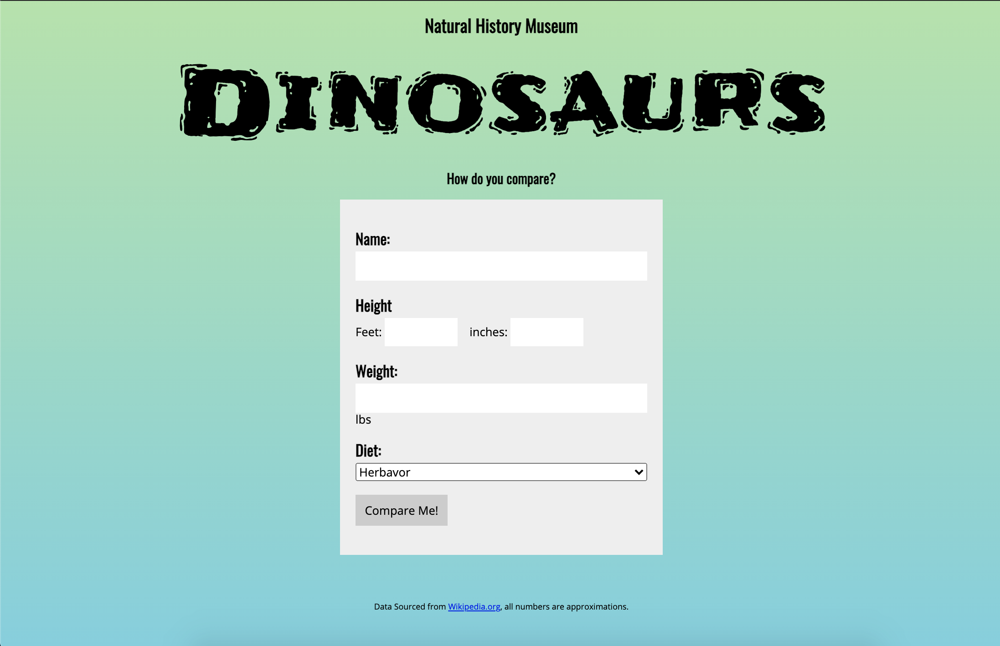
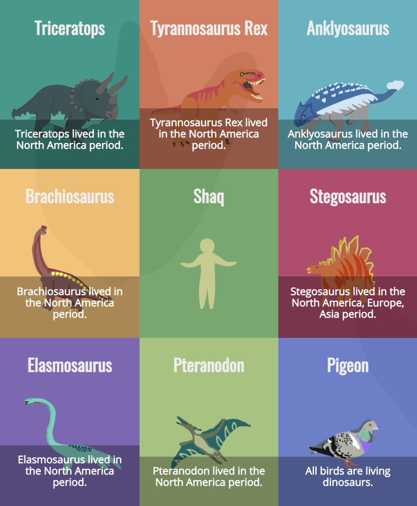

# Dinosaur Comparison Infographic

A comparison tool to show users how they relate to dinosaurs. An infographic featuring 8 dinosaurs is displayed with a fact randomly chosen between weight, height, diet, location, time period, and fun fact. Users can see new comparison facts by clicking the "Try Again" button.

User form

Infographic

## Installation

No installation needed. Open `index.html` with Live Server

## Languages and Tools Used

* Object-Oriented Javascript
* Prototypal Inheritance
